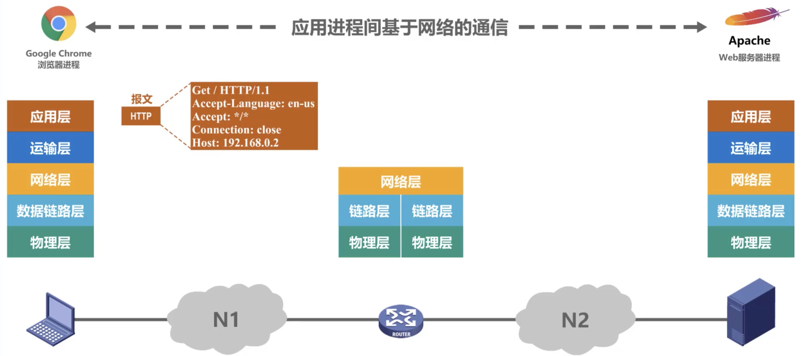
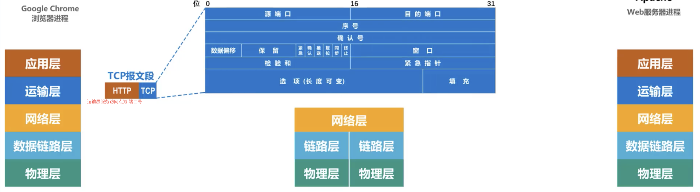
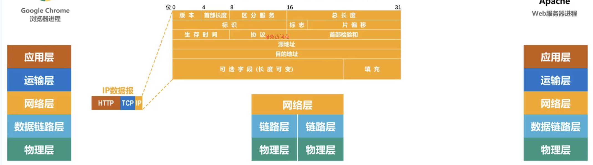
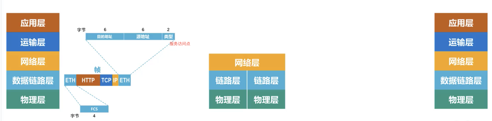
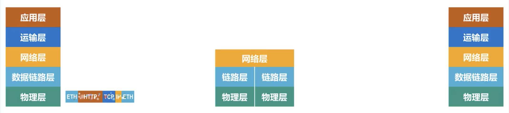
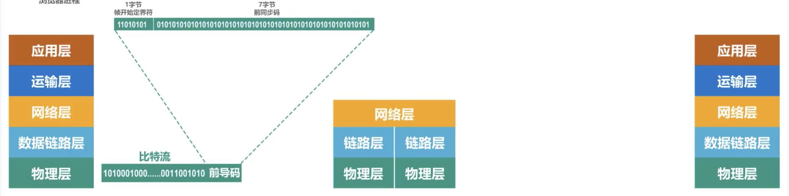
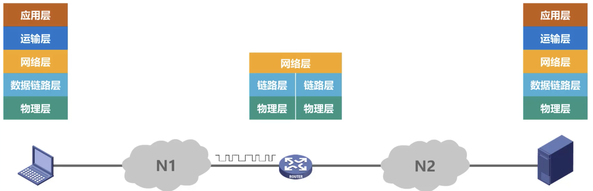
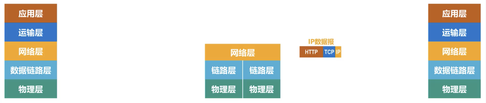
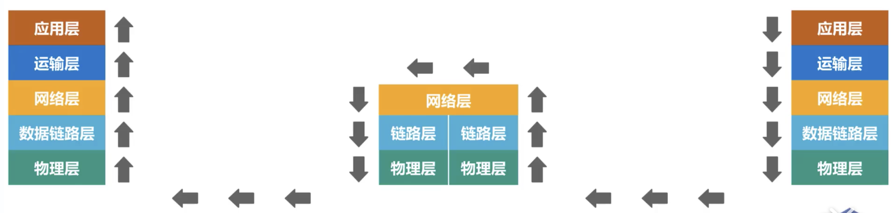

# 1.1计算机网络在信息时代的作用

### 1.计算机网络牛逼大发了反正,这一章就不吹了

# 1.2因特网概述

### 1.网络,互联网,因特网

- 网络由***节点,链路(link)***组成. ***多个网络***可以互联起来,构成范围更大的网络,即互联网,***互联网***是<u>网络的网络</u>

- 连接在互联网上的电脑叫主机(host)

- internet是通用名词,泛指互联网

- Internet(因特网)是一个专用名词,是现在在使用的美国全球范围内的特指网络,它采用***TCP/IP***协议族作为通信规则,前身是美国的***ARPANET***

### 2.发展: 

 - 1969:从单个网络ARPANET向互联网发展

    - 1969年, 第一个分组交换网ARPANET

    - 70年代中,研究多种网络之间的互联

    - 1983年,TCP/IP协议成为ARPANET的标准协议(因特网诞生时间)
 - 1985:逐步建成三级结构的因特网
    - 1985年,NSF(美国国家科学基金会)围绕六个大型计算机中心建设***NSFNET***(主干网, 地区网和校园网)
    - 1990年,ARPANET任务完成,正式关闭
    - 1991年,美国政府交给私人公司经营
  - 逐步形成了多层次ISP结构的因特网
    - 1993,NSFNET主键被若干个商用因特网主干代替,让因特网服务提供者***ISP***来运营
    - 1994,万维网WWW技术使因特网迅猛发展
    - 1995.NSFNET停止运作,因特网彻底商业化

- 因特网服务提供者***ISP(Internet Service Provider)***

  你给ISP缴费,ISP分配给你一个IP地址

  - 电信,联通,移动,中国科技网,中国教育和科研计算机网
- 基于ISP的三层结构的因特网:
    - 第一层:国际性区域(主干网)
    - 第二层:区域性或国家覆盖规模(大公司)
    - 第三层:本地范围(本地ISP) 外面接入用户

### 3.因特网标准化

- RFC(Request For Comments)技术文档

- 因特网协会(ISOC)

### 4.因特网的组成

- 边缘部分:电脑,手机,ipad,网络摄像头,服务器
- 核心部分:由***大量网络***和连接这些网络的***路由器***组成, 为边缘部分提供服务

# 1.3三种交换方式(电路交换,分组交换,报文交换)

### 1.电路交换(Circuit Switching)

- 电话交换机接通电话线的方式称为电路交换

- 从通信资源的分配角度来看,交换(Switching) 就是按照某种方式动态地分配传输线路的资源.

- 电路交换的三个步骤:

  - 建立连接(分配通信资源)

  - 通话(一只占用通信资源)

  - 释放资源(归还通信资源)

    (当使用电路交换来传送计算机数据时, 其线路的传输效率往往很低)

### 2.分组交换

发送之前,先把较长的报文分为等长数据段,每个数据段前面加上由***必要控制信息***组成的首部后(包头),构成一个分组(包).首部的作用:分组的***目的地***地址等信息

- 各部分作用
  - 发送方:构造分组 发送分组
  - 路由器:缓存分组 转发分组
  - 接收方:接受分组 还原报文

### 3.报文交换

主要用于早期的电报通信网, 加少使用,被分组交换所取代

### 4.对比

- 电路交换:
  - 优点:1.通信时延小 2. 有序传输3. 没有冲突 4.适用范围广 实时性强 5.控制简单
  - 缺点:1.建立连接时间长 2.线路独占,使用效率低 3.灵活性差 4.难以规格化
- 报文交换:
  - 优点: 1.无需建立连接 2.动态分配线路 3.提高线路可靠性 4.提高线路利用率 5.提供多目标服务(可以发送给多个地址,电路难实现)
  - 缺点: 1.引起了转发时延 2.需要较大存储缓存空间 3.需要传输额外的信息量
- 分组交换:
  - 优点: 1.无需建立连接 2.线路利用率高 3.简化了存储管理 4.加速传输 5.减少出错概率和重发数据量
  - 缺点: 1.引起了转发时延 2.需要传输额外的信息量 3.对于数据报服务,存在失序,丢失或重复分组的问题; 对于虚电路服务(虽然没有失序问题),存在呼叫建立、数据传输和虚电路释放三个过程

# 1.4计算机网络的定义和分类

### 1.计算机网络的定义: (未统一)

- 最简单的定义: 是一些***互***相***连***接的、***自治***的计算机的***集和***

  - 互联 : 计算机之间可以通过有线无线的方式数据通信

  - 自治: 独立计算机,有自己的硬件和软件 ,可以单独运行使用

  - 集合:至少两台计算机

    (一个中央集群分出来很多显示器,不是计算机网络)

- 较好的定义是:由一些***通用的、可编程的硬件互连***而成的,而这些硬件并非专门用来实现某一特定目的(例如,只传送数据或视频信号),这些可编程的硬件能够来***传送多种不同类型的数据***,并能***支持广泛和日益增长的应用***
  - 计算机网络所连接的硬件, 并不限于一般的计算机,而是包括了智能手机等智能硬件
  - 计算机网络并非专门用来传送数据,而是能够支持很多种的应用(包括今后可能出现的各种应用)

### 2.计算机网络的分类

- 按交换技术分类:电路交换网络 报文交换网络 分组交换网络

- 按使用者分类:公用网 专用网

- 按传输介质分类: 有线网络 无线网络

- 按覆盖范围分类:广域网(WAN) 城域网(MAN) 局域网(LAN) 个域网(PAN,蓝牙耳机键盘)

- 按拓扑结构分类(重要):

  - 总线型网络 : 单个线把计算机串起来 

    优:建网容易,增减节点方便,节省线路

    缺:重负载时通信效率不高,总线任意一处出现故障,全网瘫痪

  - 星型网络:将每个计算机以单独线路与中央设备相连

    优:便于网络的集中控制和管理

    缺:成本高,中央设备对故障敏感

  - 环形网络:将所有计算机串成一个环(典型例子,令牌环局域网)可以是单环,双环,环中信号单向传输

  - 网状型网络:每个节点至少由两条路径与其他节点相连,多用在广域网中,

    优:可靠性高

    缺:控制复杂,线路成本高

  

  

  

  # 1.5计算机网络的性能指标

  ### 1.速率 : 

  - 比特: 计算机中数据量单位,一个比特就是一位一位就是一个0 or 1

    ​		8bit(比特) = 1Byte (字节)	

    ​		 KB = $2^{10}$ B

    ​		 MB = K·KB = $2^{10}$ ·$2^{10}$ B = $2^{20}$B

    ​		 GB = K·MB =  $2^{10}$ · $2^{20}$ B = $2^{30}$B

    ​	      TB = K·GB =  $2^{10}$ · $2^{30}$ = $2^{40}$B

  - 速率:传送比特的速率->比特率 数据率

    ​		 bit/s(b/s,bps) 

    ​		 kb/s = $10^3$ b/s(bps)  

    ​		Mb/s = k · kb/s = $10^3$ · $10^3$ b/s = $10^6$b/s(bps)

    ​		Gb/s = k · Mb/s = $10^3$ · $10^6$b/s = $10^9$b/s(bps)

    ​		Tb/s = k · Gb/s = $10^3$ · $10^9$ b/s = $10^{12}$b/s(bps)

    

    > [例] 有一个待发送的数据块,大小为100MB,网卡的发送速率为100Mbps, 则网卡发送完该数据块需要多长时间?
    >
    > [解]
    >
    > 严格来说,两个M不能约掉:
    > $$
    > \frac{100MB}{100Mb/s} = \frac{MB}{Mb/s} = \frac{2^{20} \cdot 8b}{10^{6}b/s} = 8.388608s
    > $$
    > (平时估算:)
    > $$
    > \frac{100MB}{100Mb/s} = \frac{MB}{Mb/s} \approx \frac{B}{b/s} = \frac{8b}{b/s} = 8s
    > $$
    > 
    >
    > [例] [考研2013年35题].  主机甲通过1个路由器（存储转发方式）与主机乙互联，两段链路的数据传输速率均为10Mbps，主机甲分别采用报文交换和分组大小为10kb的分组交换向主机乙发送1个大小为8Mb（1M=10^6）的报文。若忽略链路传播延迟、分组头开销和分组拆装时间，则两种交换方式完成该报文传输所需的总时间分别为
    >
    >  A．800 ms、1 600 ms 	B．801 ms、1 600 ms 	C．1 600 ms、800 ms 	D．1 600 ms、801 ms 
    >
    > 【解析】根据题意，画出如下拓扑。 
    >
    > ​								主机甲-------------->路由------------------> 主机乙
    >
    > 1.报文交换的总时延 = 主机甲的发送时延 + 路由器的发送时延 
    >
    > ​								= 8Mb/10Mbps × 2 
    >
    > ​								=1600ms  
    >
    > 2.分组交换的总时延有以下两种解法：
    >
    >  解法一： 
    >
    > （1）待发送分组数量 = 8Mb / 10kb = 800 组
    >
    > （2）第1个分组的总时延 = 主机甲的发送时延 + 一个路由器的发送时延  
    >
    > ​										= 10kb/10Mbps + 10kb/10Mbps 
    >
    > ​										= 20kb/10Mbps 
    >
    > （3）主机甲发送完第1个分组后接着发送第2个分组，也就是说第2个分组比第1个分组慢一个发送时延，同理，第3个分组比第2个分组慢一个发送时延，…，第800个分组比第799个分组慢一个发送时延； 综合（1）、（2）、（3）可知，
    >
    > 总时延 = 第1个分组的总时延 + 发送时延 × 799
    >
    > ​		   = 20kb/10Mbps + (10kb/10Mbps) × 799                 
    >
    > ​	       = 8010kb/10Mbps                  
    >
    > ​           = 801ms
    >
    > 
    >
    >  解法二： 
    >
    > （1）主机甲的发送时延 = 待发送数据量 / 链路的数据传输速率 
    >
    > ​									   = 8Mb/10Mbps 
    >
    > （2）经过主机甲的发送时延后，最后一个分组才刚从主机甲发送的链路上，它还要经过一个路由器的转发才能到达主机乙。 综合（1）和（2）可知，
    >
    > 总时延 = 主机甲的发送时延 + 最后一个分组的路由器转发时延              
    >
    > ​			= 8Mb/10Mbps + 10kb/10Mbps              
    >
    > ​			= 801ms  
    >
    > 
    >
    > 【注意】本题与2010年第34题类似。

    

    

    

  ### 2.带宽

  - 带宽在模拟信号系统中的意义

    ***信号***所包含的各种***不同频率成分***所占据的***频率范围***,单位Hz(kHz、MHz、GHz) 

    > [例]传统有线电话,带宽3.1kHz(300Hz~3.4kHz). 
    >
    > ​	  WCDMA一个载波上下行各5MHz，
    >
    > ​	  LTE FDD一个载波最大上下行各20MHz

  - 带宽在计算机网络中的意义

    表示网络的***通信线路***所能传送数据的能力,***网络带宽***表示单位时间内,一点到另一点所能通过的***“最高数据率”*** . 单位b/s(kb/s, Mb/s, Gb/s, Tb/s)

    > “带宽”的这两种表述之间有着密切的联系. 一条通信线路的“频带宽度“越宽,其所传输数据的“最高数据率”也越高

  

  ### 3.吞吐量

  - 吞吐量表示在***单位时间内通过某个网络(或信道、接口)的数据量***

  - 吞吐量经常用于对网络的测量,知道有多少数据量能够通过网络

  - 吞吐量***受网络的带宽或额定速率的限制***

    > [例] 带宽为1Gb/s的以太网,吞吐量受带宽限制,最高位1Gb/s,通常只能达到700Mb/s

  

  ### 4.时延

  - 发送时延(主机) :  $$ \frac{分组长度(b)}{发送速率(b/s)}$$

  - 传播时延(线路) : $$ \frac{信道长度(m)}{电磁波传播速率(m/s)}$$	自由空间 : 3 x $10^8$m/s

    ​													 铜	   线 : 2.3 x $10^8$ m/s

    ​													 光	   纤 : 2.0 x $10^8$ m/s

  - 处理时延(路由) : 硬件性能不同,不好用公式表示 (一般题中指明忽略不计)

  >[例]
  >
  >​		主机-----------------(线)--------------------->交换机				result
  >
  >网卡发送速率				信道带宽						接口速率			发送速率
  >
  >1Gb/s							1Gb/s							1Gb/s				1Gb/s
  >
  >100Mb/s						1Gb/s							1Gb/s				100Mb/s
  >
  >1Gb/s							100Mb/s						1Gb/s				100Mb/s

  

  > [例] 数据块长度为100MB
  >
  > ​	  信道带宽为1Mb/s
  >
  > ​	  传送距离为1000km(假设光纤)
  >
  > ​	  计算发送时延和传播时延?
  >
  > [解] 
  > $$
  > 发送时延 =   \frac{分组长度(b)}{发送速率(b/s)} = \frac{100 \times2^{20} \times 8(b)}{10 ^ 6(b/s)} = 838.8608(s)
  > $$
  > 
  > $$
  > 传播时延= \frac{信道长度(m)}{电磁波传播速率(m/s)} = \frac{1000 \times 10^3(m)}{2 \times 10^8(m/s)} = 0.005(s)
  > $$
  > 
  >
  > [结论] 发送时延占主导

  

  > [例] 数据块长度为1B
  >
  > ​	  信道带宽为1Mb/s
  >
  > ​	  传送距离为1000km(假设光纤)
  >
  > ​	  计算发送时延和传播时延?
  >
  > [解]
  > $$
  > 发送时延 =   \frac{分组长度(b)}{发送速率(b/s)} = \frac{1  \times 8(b)}{10 ^ 6(b/s)} = 8 \times 10^{-6}(s)
  > $$
  > 
  > $$
  > 传播时延= \frac{信道长度(m)}{电磁波传播速率(m/s)} = \frac{1000 \times 10^3(m)}{2 \times 10^8(m/s)} = 0.005(s)
  > $$
  > [结论] 传播时延占主导

  

  

  ### 5.时延带宽积

  $$
  时延带宽积 = 传播时延 \times 带宽
  $$

  

  >​	看作是一个管道:
  >
  >​						    	<-----传播时延----> 
  >
  >​							 (||||||||||||||||||||||||||||||||||||||||O	<- 横截面积为***带宽***
  >
  >

  - 若发送端连续发送数据,则在所发送的第一个比特即将到达终点时,发送端就已经发送了***时延带宽积****个比特 (往麻袋里倒比特,第一个到底了,共倒了时延带宽积个比特)
  - 链路的时延带宽积 又称为 ***以比特为单位的链路长度***

  

  ### 6.往返时间

  - 信息不仅仅单方向传输,而是双向交互

  - 需要知道,双向交互一次所需的时间

  - 往返时间***RTT(Round-Trip Time)***也是重要性能指标

    > [例] 
    >
    > 主机---->路由--->任意网络-->任意网络--> 卫星链路(耗时较多)--> 任意网络 -->无线局域网
    >
    > 卫星链路时延 = $$\frac{36000(km)}{300000(km/s)} \times 2 = 0.24(s) = 240(ms)$$

  

  ### 7.利用率

  - 利用率:

    - 信道利用率 : 用来表示某信道有百分之几的时间是被利用的(有数据通过)
    - 网络利用率 : 全网络的信道利用率的加权平均

  - 根据排队论,当某信道的利用率增大时,该信道引起的时延也会迅速增加

  - ***信道利用率并非越高越好***

  - $D_0$表示网络空闲时的时延,D表示网络当前的时延,U利用率,适当条件下公式:
    $$
    D = \frac{D_0}{1 - U}
    $$
    

    - 当网络利用率***达到***50%时,时延加倍
    - 当网络利用率***超过***50%时,时延***急剧增大***
    - 当网络利用率***接近***100%时,时延趋于无穷大
    - 因此,一些拥有较大主干网的ISP会控制信道利用率不超过50%,若超过了就扩容,增大带宽
    - 也不能利用率太低资源浪费,应使用机制动态调整通信量,使利用率保持在一个合理范围内

  

  

  ### 8.丢包率

  - 丢包率即分组丢失率, 是指在一定的时间范围内, 传输过程中***丢失的分组数量***与***总分组数量***的比率
  - 丢包率具体分为 接口丢包率 节点丢包率 链路丢包率 路径丢包率 网络丢包率
  - 分组丢失主要分两种情况:
    - 分组在传输过程中出现***误码***,被节点丢器
    - 分组到达一台队列已满的分组交换机时被丢弃,在通信量较大时就可能造成***网络用塞***
  - 因此,丢包率反映了网络的拥塞情况
    - 无拥塞时路径丢包率为0
    - 轻度拥塞时路径丢包率为1%~4%
    - 严重拥塞时路径丢包率为5%~15%

   

  # 1.6计算机网络体系结构

  ### 1.常见的计算机网络体系结构

  - IP协议的中文意思是***网际协议***, TCP/IP体系结构的网络层常被称为网际层,

  

  

  - TCP/IP结构的***网络接口层***并没有规定什么具体内容, 目的是可以互连全世界各种不同的网络接口,例如有线的以太网接口,无线的wifi接口,因此本质上TCP/IP只有上面三层.

  - IP协议是***网际层***的核心协议,IP协议可以将不同的***网络接口***进行互连,并向其上的TCP和UDP提供网络互连服务

  - TCP基于IP向***应用层***提供可靠传输服务

  - UDP基于IP向***应用层***提供不可靠传输服务

    ​				

    

    

    

    

    - [注意] 由于TCP/IP并没有规定网络接口层具体内容,为了方便教学,把网络接口层拿出来说明,不要搞混淆

    

    

    

    

  ### 2.计算机网络体系结构分层的必要性

  - 计算机网络是个非常复杂的系统

  - 分层可将庞大而复杂的问题,转化为局部小问题

  - 计算机网络面临着主要问题,需要用分层由简单到复杂逐步解决

    ***1.***两台计算机连接,用什么传输媒介?采用什么形状的接口?使用怎样的信号表示比特0和1?    ->  ***层一.物理层***

    

    ***2.***在总线结构中,如何标识网络中的***各个主机***(主机编址问题,如***MAC地址***).如何从一串比特流中区分出地址和数据?如何协调各个主机征用总线(交换机) ?	->	 ***层二.数据链路层***

    

    

    ***3.***因特网中有许***多个网络***,如何标识各个网络以及网络中的各主机(网络和主机***共同编址***的问题)?路由器如何转发分组,如何进行路由选择?	-> 层三.网络层

    

    ***4.***对于计算机网络的应用而言,主机收到***来自服务器***分组,应该交给***哪个进程***处理? 如何解决进程之间基于网络的通信问题?出现传输错误时,如何处理?	->  层四.运输层

    

    ***5.*** 通过应用进程间的交互来完成特定的网络应用(支持万维网应用的HTTP协议,支持电子邮件的SMTP协议,支持文件传送的FTP协议)	-> 层五.应用层

    

    [总结]:

    

    

    

    

  ### 3.计算机网络体系结构分层思想举例

  浏览器构建一个http请求报文

  

  应用层将http报文交给运输层处理,***运输层***给http报文添加一个TCP头部,使得整个成为***TCP报文段***,(区分应用进程,实现可靠传输)

  

  交给网络层处理,网络层添加一个IP首部,使得整个成为***IP数据报***(使IP数据报可以在互联网上传输,被路由器转发)

  

  网络层交给数据链路层处理,数据链路层添加***一个首部和一个尾部***使整个成为***贞***(***首部:***使得贞可以在链路上传输,被相应目的主机接收MAC, ***尾部:***让目的主机检查是否有误码)

  

  交付给物理层,物理层将贞看作比特流,该物理层(以太网)给贞添加一个***前导码***(让目的主机做好接收贞的准备)

  

  

  物理层将添加有前导码的比特流变换成相应的信号,发送到传输媒体,传输媒体将信号发送到路由器

  ### 

  

  

  

  到达路由器:

  物理层将信号变换为比特流,然后去掉前导码

  

  去掉前导码后,交付给数据链路层(实际交付贞),

  

  数据链路层去掉首部和尾部后交付给网络层(交付IP数据报)

  

  网络层解析IP数据包首部,查找目的网络地址,然后查找自身路由表,确定转发端口

  

  

  网络层将IP数据报交付给数据链路层

  数据链路层添加首部尾部,成为贞,交给物理层

  接下来的步骤类似......

  

  ...................

  .........

  ...

  最终逐层解封,最终取回http响应报文

  

  

  

  ### 4.计算机网络体系结构中的专用术语

  ***1.实体***

  - 实体 任何可发送或接收信息的硬件或软件进程
  - 对等实体 收发双方相同层次中的实体 (google浏览器-Apache, 主机的网卡-服务器的网卡)

  

  ***2.协议***

  - 协议 控制两个对等实体进行***逻辑通信***的规则的集合(逻辑通信其实是我们假设出来的一种通信,方便我们单独研究某一层,不用考虑其他层)

    

    应用层协议使用HTTP SMTP进行通信

    运输层协议使用TCP,UDP进行通信

    网络层协议使用IP进行通信

    链路层协议传统以太网CSMA/CD进行通信

    物理层协议 传统以太网使用曼彻斯特编码 进行痛惜

  - 协议的三要素 语法 语义 同步

    - 语法 定义所交换信息的格式 (如TCP首部,IP头部)

    - 语义 定义收发双方所要完成的操作 (收到分组后完成怎样的操作 http发送请求,返回一个网页)

    - 同步 定义收发双方的时序关系 (如TCP三次握手)

      

      

  ***3.服务***

  - 在协议的控制下,两个对等实体间的逻辑通信使得本层能够向上一层提供服务

  - 要实现本层协议,还需要使用下面一层所提供的服务

  - 协议是"水瓶的",服务是”垂直的“

  - 实体看得见相邻下层所提供的服务, 但并不知道实现该服务的具体协议,也就是所下面的协议对上面的实体是***透明的***

    

  - 服务访问点 在同一系统中***相邻两层的实体交换信息的逻辑接口***, 用于区分不同的服务类型
    - 数据链路层的服务访问点为***帧的“类型”字段***
    - 网络层的服务访问点为***IP数据报首部中的“协议字段”***
    - 运输层的服务访问点为***“端口号”***
  - 服务原语 上层使用下层所提供的服务必须通过与下层***交换一些命令***,这些命令称为服务原语

  

  

  - 协议数据单元***PUD***	***对等层次之间传送的数据包***称为该层的协议数据单元
  - 服务数据单元***SUD***	***同一系统内,层与层之间交换的数据包***称为服务数据单元
  - 多个SDU可以合成为一个PDU:一个SDU也可划分为几个PDU

